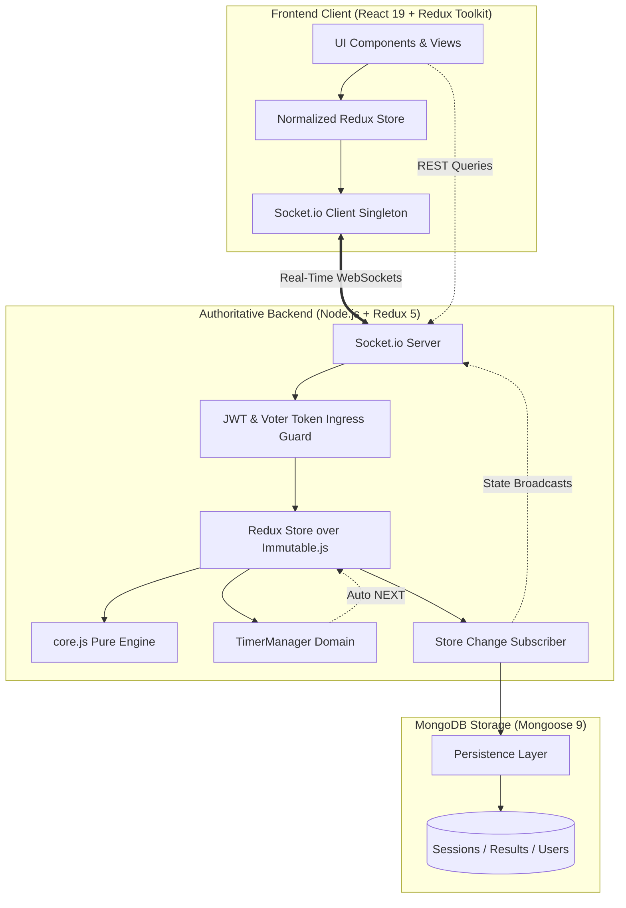

# VoteSphere — Full-Stack Real-Time Pairwise Voting Application

[]()
[](#testing--verification)
[](#testing--verification)
[](#testing--verification)
[](#testing--verification)
[](#testing--verification)
[](#architecture)

VoteSphere is an enterprise-grade, real-time pairwise and single-ballot voting platform. Built with an authoritative backend architecture, VoteSphere eliminates voting fatigue and tactical distortion by breaking candidate pools down into head-to-head tournament matchups or clean single ballots, all synchronized live across connected voters via WebSockets and backed by durable MongoDB persistence.

---

## Table of Contents

- [The Problem VoteSphere Solves](#the-problem-votesphere-solves)
- [Key Features](#key-features)
- [Architecture](#architecture)
- [Technology Stack](#technology-stack)
- [Project Structure](#project-structure)
- [Session Lifecycle](#session-lifecycle)
- [Server-Authoritative Timer & Round Progression](#server-authoritative-timer--round-progression)
- [Getting Started](#getting-started)
- [Environment Variables](#environment-variables)
- [API & WebSocket Protocol](#api--websocket-protocol)
- [Testing & Verification](#testing--verification)
- [Screenshots & UI Tour](#screenshots--ui-tour)
- [License](#license)

---

## The Problem VoteSphere Solves

In traditional multi-candidate elections and polls, participants are confronted with long, monolithic ballots. This routinely causes:
- **Cognitive Fatigue:** Voters lose patience and resort to random selections or default to the first candidate.
- **Strategic / Tactical Voting:** Voters cast ballots against contenders rather than for their actual preferences to avoid split votes.
- **Split-Vote Anomalies:** Similar candidates divide the vote share, allowing an unrepresentative alternative to win.

**VoteSphere solves this** through head-to-head pairwise elimination tournament matchups (`pair[0]` vs `pair[1]`). Round winners return to the candidate pool until an undisputed tournament champion emerges. For smaller contests (≤ 6 candidates), VoteSphere seamlessly supports a **Single-Ballot** plurality mode with built-in instant tie runoff mechanics.

All mathematical operations, vote tabulations, round advancements, duplicate-ballot prevention, and quorum determinations run exclusively on the **authoritative backend Redux engine**. Connected clients operate purely as reactive presentation layers.

---

## Key Features

### 1. Dual Voting Modes
- **Pairwise Tournament Mode:** Head-to-head elimination bracket where candidate pairs compete sequentially until an undisputed champion is determined.
- **Single-Ballot Mode:** Automatic direct ballot for pools with 2 to 6 candidates (`SINGLE_BALLOT_MAX = 6`) with instant plurality detection.

### 2. Monotonic Round Results Lifecycle
- Every round transitions through four deterministic phases:
  $$\text{VOTING} \longrightarrow \text{ROUND\_CLOSED} \longrightarrow \text{RESULTS\_REVEALED} \longrightarrow \text{NEXT}$$
- **Frozen Results Snapshot (`finalVote`):** When a round closes, an immutable `{ pair, tally, closedAt }` snapshot is frozen. Live tallies are never leaked to participants while voting is active.
- **Dedicated Reveal Countdown:** Authoritative reveal countdown (`ROUND_REVEAL_DURATION`, default 10s) gives participants time to review round outcomes before the server transitions to the next round.

### 3. Server-Authoritative Tie Resolution Ladder
- **First Tie:** Triggers an immediate rematch in tournament mode, or a runoff ballot featuring only the tied candidates in single-ballot mode.
- **Second Consecutive Tie:** Transitions to `TIE_PENDING`, arming a 30-second admin window allowing the session host to select a winner (`RESOLVE_TIE`). If the timer expires before an admin acts, an automated cryptographic coin flip resolves the tie authoritatively.
- **Zero-Vote Handling:** If zero votes are submitted, the round replays once with a warning; if zero votes recur, the match terminates safely as `no_result`.

### 4. Dual-Path Early Round Completion
- A round completes immediately upon **either**:
  1. The authoritative round countdown reaches `00:00`, or
  2. 100% of currently eligible active voters submit valid ballots.
- Dynamic eligibility accounts for disconnects within a 10-second grace window (`GRACE_PERIOD_MS = 10000`).

### 5. Multi-Session Room Isolation
- Supports unlimited concurrent sessions (e.g. `sess_annual_2026`, `sess_team_lunch`).
- Socket.io room partitioning (`session:${sessionId}`) guarantees state updates, chat, timers, and participants in Session A never bleed into Session B.

### 6. Two-Tier Identity & Access Controls
- **Public Sessions:** Frictionless participation via display name; session-scoped cryptographic voter token (`crypto.randomUUID()`) delivered via JSON and cookie.
- **Secured Sessions:** Verified voter accounts with passwordless Email + OTP (One-Time Password) authentication. Supports allowlists (`whoCanJoin: "allowlist"`) and manual host admission queues (`whoCanJoin: "approval"`).
- **Session Administrator:** JWT-authenticated host portal at `/admin` for session setup, lifecycle triggers, participant approvals, and real-time QR generation.

### 7. Guaranteed Duplicate Vote Prevention
- The backend tracks ballots on a composite round-scoped key:
  $$\text{Key} = \$\{\text{sessionId}\} ::: \$\{\text{roundId}\} ::: \$\{\text{sortedPair}\} ::: \$\{\text{voterToken}\}$$
- Prevents ballot stuffing and replay attacks. When a candidate pair advances or rematches in a subsequent round, `roundId` increments monotonically, unlocking eligible voters for the new round without requiring re-authentication.

### 8. MongoDB Persistence & Automatic Startup Recovery
- Non-blocking Redux store subscriber streams session metadata, participant rosters, and tournament results asynchronously to MongoDB.
- Protects original candidate rosters from pairwise queue reduction.
- Automatic recovery resets interrupted `open` sessions to `pending` on backend boot, restoring active tournaments cleanly into Redux memory.

### 9. Public Results History Archive
- Public REST endpoints (`GET /api/sessions/history` and `GET /api/sessions/:sessionId/result`) serve completed tournaments, final champions, candidate rosters, and round-by-round tally histories.

---

## Architecture

VoteSphere follows a **Server-Authoritative Flux & Clean Architecture** model:



### Architectural Guarantees
1. **The Server is Authoritative:** The client is purely a reactive view engine. The frontend never computes tallies, checks quorum, breaks ties, or triggers `NEXT`.
2. **Protected Pure Core (`core.js`):** The mathematical tournament core (`voting-server/src/core.js`) is an immutable, pure function module strictly preserved with a pinned SHA-256 hash (`b479f3f0b90c5bd81e1a813b3c5753179efeecd08a531aa833000b65188fb310`).
3. **Sequential Database Writes:** Dedicated write queues per session (`enqueueSessionWrite`) eliminate out-of-order document transitions between concurrent lifecycle dispatches and MongoDB upserts.

---

## Technology Stack

| Layer | Technologies & Libraries |
|---|---|
| **Frontend** | React 19, Redux Toolkit 2.x, React Router 7.x, Recharts 3.x, Lucide React, QRCode, Vanilla CSS Modules |
| **Frontend Tooling** | Vite 8.x, ESLint 10.x, Node test runner (`node:test`) |
| **Backend Runtime** | Node.js 18+ (verified on Node 22 & 24), ECMAScript Modules (`type: module`), Babel register |
| **Backend State & Core** | Redux 5.x, Immutable.js 3.x, Pinned Pure Functional Core Engine |
| **Real-Time Communication** | Socket.io 4.x (WebSocket transport with long-polling fallback) |
| **Database & ODM** | MongoDB 6.0+, Mongoose 9.x |
| **Security & Auth** | JSON Web Tokens (`jsonwebtoken`), Bcrypt password hashing (`bcrypt`), HttpOnly cookies |
| **Email & Delivery** | Nodemailer 10.x (SMTP transport with safe console fallback for dev) |
| **Testing Frameworks** | Mocha 10.x, Chai 4.x, Chai-Immutable, `mongodb-memory-server` 11.x, `node:test` |

---

## Project Structure

```text
fullstack-redux-voting-app/
├── .env.example                     # Environment template with documented defaults
├── .gitignore                       # Clean Git exclusion rules
├── AGENTS.md                        # Context and architecture guidelines
├── docs/                            # Specifications and architectural design notes
│   ├── ARCHITECTURE.md              # In-depth architectural documentation
│   ├── API_CONTRACT.md              # REST & Socket event schemas
│   ├── VOTESPHERE_FULL_SPEC.md      # Comprehensive product specification
│   ├── specs/                       # Numbered feature specifications (0001-0005)
│   └── reviews/                     # Verification audits & review logs
├── voting-client/                   # React 19 Frontend Application
│   ├── package.json                 # Client dependencies and npm scripts
│   ├── vite.config.js               # Vite build configuration
│   ├── src/
│   │   ├── components/              # Reusable UI components (Navbar, Timer, Charts)
│   │   ├── pages/                   # Route views (Admin, Lobby, Voting, Results, Join)
│   │   ├── redux/                   # Redux Toolkit store, voteSlice, voterAuthSlice
│   │   ├── routes/                  # App routing hierarchy
│   │   └── services/                # Socket.io connection and REST API clients
│   └── test/                        # 27 node:test specification suites (373 tests)
└── voting-server/                   # Authoritative Backend Engine
    ├── package.json                 # Server dependencies and npm scripts
    ├── index.js                     # Server entrypoint and MongoDB connection
    ├── src/
    │   ├── core.js                  # PURE, PROTECTED tournament engine (do not edit)
    │   ├── reducer.js               # Root multi-session Redux reducer
    │   ├── server.js                # HTTP server, Socket.io protocol, ingress guards
    │   ├── timer.js                 # TimerManager authoritative round clock
    │   ├── roundManager.js          # Monotonic round results lifecycle coordinator
    │   ├── ballot.js                # Single-ballot plurality and runoff engine
    │   ├── auth/                    # Admin JWT, voter tokens, OTP, voter cookies
    │   ├── db/                      # Mongoose connection, models, repository, persistence
    │   └── email/                   # Nodemailer OTP email transporter
    └── test/                        # 32 Mocha test suites (598 tests)
```

---

## Session Lifecycle

Sessions follow a strict, monotonic four-stage lifecycle:

```text
    [ CREATE_SESSION ]
            │
            ▼
       ┌─────────┐
       │ pending │ ◄── Waiting room lobby, participant check-in, QR code sharing
       └────┬────┘
            │ [ START_SESSION ] (Admin only)
            ▼
       ┌─────────┐
       │  open   │ ◄── Active voting rounds, countdown timer, live matchup brackets
       └────┬────┘
            │ [ Final Winner Determined / All Pairs Concluded ]
            ▼
       ┌───────────┐
       │ completed │ ◄── Podium view, candidate vote totals, archived into MongoDB
       └────┬──────┘
            │ [ ARCHIVE_SESSION ] (Admin two-step confirmation)
            ▼
       ┌──────────┐
       │ archived │ ◄── Read-only archival; in-memory voter tokens safely freed
       └──────────┘
```

- **`pending`:** The session is created. Participants can join the lobby (`/sessions/:id/lobby`), enter display names or authenticate, and see live connected counts. Voting is disabled.
- **`open`:** The tournament is live. Pairwise matchups or single ballots are presented to voters. Rounds progress authoritatively through `VOTING` → `ROUND_CLOSED` → `RESULTS_REVEALED`.
- **`completed`:** All matchups have concluded and an official winner has emerged. Results are frozen and committed to the MongoDB `results` collection.
- **`archived`:** The session has been retired by an administrator. Memory cleanup disposes of in-memory participant maps and vote records.

---

## Server-Authoritative Timer & Round Progression

1. **Default Duration:** 30 seconds per round (`VOTE_TIMER_DURATION=30`).
2. **Configurable Range:** 5 seconds to 300 seconds (enforced at session creation).
3. **Server Authority:** Timers run strictly inside the backend `TimerManager`. Client countdowns are visual estimates synchronized on `timer_state` events.
4. **On Timer Expiry:**
   - The server closes the round authoritatively.
   - Any ballot submitted after expiry is rejected with `action_error: { error: 'ROUND_CLOSED' }`.
   - The server freezes the outcome into `finalVote` and broadcasts `ROUND_CLOSED`.
   - The reveal countdown (`ROUND_REVEAL_DURATION`, default 10s) begins.
   - Upon reveal expiration, the backend dispatches `NEXT` into Redux, loading the next pair or concluding the championship.

---

## Getting Started

### Prerequisites
- **Node.js:** v18.0.0 or higher (tested on Node 18, 20, 22, and 24 LTS)
- **MongoDB:** v6.0+ (running locally on port 27017 or a remote MongoDB connection string)
- **Package Manager:** `npm` v9 or higher

### 1. Clone the Repository
```bash
git clone https://github.com/Nisam97/fullstack-redux-voting-app.git
cd fullstack-redux-voting-app
```

### 2. Configure Environment Variables
Copy the example environment configuration into `.env` at the project root:
```bash
cp .env.example .env
```
*(Review and customize values in `.env` if using a remote MongoDB cluster or customized credentials).*

### 3. Install Dependencies
VoteSphere uses two clean packages without monorepo tooling:
```bash
# Install backend dependencies
cd voting-server && npm install

# Install frontend dependencies
cd ../voting-client && npm install
```

### 4. Start the Application
Open two terminal windows:

**Terminal 1 — Backend Server (Port 8090):**
```bash
cd voting-server
npm start
```
*Starts the Node HTTP server, connects to MongoDB, recovers active sessions, and initializes Socket.io on port 8090.*

**Terminal 2 — Frontend Client (Port 5173):**
```bash
cd voting-client
npm run dev
```
*Vite starts the modern frontend interface at `http://localhost:5173`.*

---

## Environment Variables

All settings are configured via `.env` in the root folder. The backend automatically reads this file on startup:

| Variable | Default Value | Description |
|---|---|---|
| `PORT` | `8090` | HTTP and WebSocket port for the backend server |
| `MONGODB_URI` | `mongodb://localhost:27017/votesphere_dev` | MongoDB connection URI |
| `JWT_SECRET` | *Random secret string* | Secret key for signing administrative JSON Web Tokens |
| `JWT_EXPIRES_IN` | `24h` | Admin JWT expiration duration |
| `ADMIN_USERNAME` | `admin` | Seeded administrator username |
| `ADMIN_EMAIL` | `admin@votesphere.local` | Seeded administrator email address |
| `ADMIN_PASSWORD` | `adminPassword123!` | Seeded administrator password (bcrypt hashed on boot) |
| `CORS_ALLOWED_ORIGINS` | `http://localhost:5173,http://127.0.0.1:5173` | Allowed browser origins for credentials |
| `CLIENT_ORIGIN` | `http://localhost:5173` | Explicit frontend origin for Cookie reflection |
| `COOKIE_SECURE` | `false` | Set to `true` in production with HTTPS |
| `TRUST_PROXY` | `false` | Enable only behind reverse proxies to prevent IP spoofing |
| `VOTER_JWT_SECRET` | *Random secret string* | Secret used to sign `vs_voter` authentication cookies |
| `VOTER_SESSION_DAYS` | `7` | Lifetime of voter authentication session (days) |
| `SMTP_HOST` | *(empty)* | SMTP host for email OTP. If empty, OTPs print to console |
| `SMTP_PORT` | `587` | SMTP port |
| `SMTP_USER` | *(empty)* | SMTP username |
| `SMTP_PASS` | *(empty)* | SMTP password |
| `MAIL_FROM` | `noreply@votesphere.local` | From address for outgoing voter OTP emails |
| `OTP_TTL_MINUTES` | `10` | One-time password expiration window (minutes) |
| `VOTE_TIMER_DURATION` | `30` | Default round duration in seconds (5–300) |
| `ROUND_REVEAL_DURATION`| `10` | Results reveal countdown window in seconds |
| `VITE_SERVER_URL` | `http://localhost:8090` | *(Frontend)* Target backend WebSocket and API address |

---

## API & WebSocket Protocol

### HTTP REST Endpoints

| Method | Endpoint | Access | Purpose |
|---|---|---|---|
| `POST` | `/api/admin/login` | Public | Authenticates admin credentials, returns JWT token |
| `GET` | `/api/auth/me` | Admin | Validates admin JWT bearer header |
| `GET` | `/api/sessions` | Public | Lists session catalog summaries |
| `GET` | `/api/sessions/:id/lobby` | Public | Hydrates lobby metadata, status, and connected headcount |
| `POST` | `/api/sessions/:id/join` | Public | Enrolls a voter with display name, returns session-scoped token |
| `GET` | `/api/sessions/history` | Public | Retrieves paginated historical tournament completions |
| `GET` | `/api/sessions/:id/result` | Public | Retrieves specific completed tournament outcome and full roster |
| `GET` | `/api/sessions/:id/rounds` | Public | Retrieves round-by-round tally history (revealed rounds only) |
| `POST` | `/api/auth/voter/request-otp` | Public | Requests a 6-digit OTP code for secured sessions |
| `POST` | `/api/auth/voter/verify-otp` | Public | Verifies OTP code and sets session authentication cookie |
| `GET` | `/api/auth/voter/me` | Voter | Returns current voter profile from authentication cookie |

### Socket.io Real-Time Events

| Event | Direction | Payload Description |
|---|---|---|
| `subscribe_session` | Client → Server | `{ sessionId, voterToken? }` Subscribes to room and records presence |
| `unsubscribe_session`| Client → Server | `{ sessionId }` Unsubscribes from room and updates presence |
| `action` | Client → Server | Redux action dispatch (`VOTE`, `NEXT`, `CREATE_SESSION`, `START_SESSION`, `RESOLVE_TIE`, etc.) |
| `sessions` | Server → Client | Global registry summary updates |
| `session_state` | Server → Client | Authoritative room state (`pair`, `status`, `roundLifecycle`, `finalVote`) |
| `lobby_update` | Server → Client | Live connected headcount and session status |
| `presence_update` | Server → Client | Real-time active voter headcount in session room |
| `timer_state` | Server → Client | Authoritative clock state (`duration`, `remaining`, `expiresAt`, `status`) |
| `tie_pending` | Server → Client | Armed tie-resolution state for tied matchups |
| `action_error` | Server → Client | Feedback on unauthorized, duplicate, or invalid actions |

---

## Testing & Verification

VoteSphere maintains comprehensive test coverage across both frontend and backend packages:

### Execute Backend Test Suite
```bash
cd voting-server
npm test
```
**Results:** **598 passing** (0 failing across 32 spec files in Mocha).

### Execute Frontend Test Suite
```bash
cd voting-client
npm test
```
**Results:** **373 passing** (0 failing across 27 spec files in Node test runner).

### Code Quality & Production Build
```bash
cd voting-client
npm run lint    # ESLint verification: 0 errors, 0 warnings
npm run build   # Production Vite bundle: built cleanly in ~6 seconds
```

**Overall Verified Status:** **971 automated tests passing**, 0 failing, 0 lint warnings.

---

## Screenshots & UI Tour

<!-- Screenshots Placeholder: Visual documentation of key user journeys -->
> *UI screenshots will be captured and added following deployment.*

| View | Description | Placeholder |
|---|---|---|
| **Lobby & Waiting Room** | Real-time participant waiting room with live headcount and QR share code | `[Screenshot: Lobby View]` |
| **Voting Arena** | Live head-to-head pairwise matchup with countdown timer and vote selection | `[Screenshot: Pairwise Arena]` |
| **Results & Podium** | Real-time animated Recharts vote distribution bars and championship podium | `[Screenshot: Results Podium]` |
| **Admin Control Panel** | Host management dashboard with session creation modal and lifecycle controls | `[Screenshot: Admin Panel]` |
| **Tournament Archive** | Completed historical tournament records catalog with round-by-round tallies | `[Screenshot: History Archive]` |

---

## License

This project does not currently have an open source license attached. A license decision is required before public distribution or commercial use (common choices include [MIT](https://opensource.org/licenses/MIT) for permissive open-source or [Apache-2.0](https://www.apache.org/licenses/LICENSE-2.0) for patent protections).
